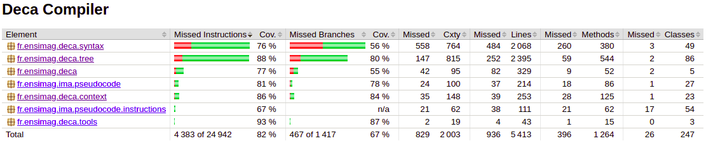

# Descriptif des tests
- [Descriptif des tests](#descriptif-des-tests)
  - [Organisation des tests](#organisation-des-tests)
  - [Type de tests](#type-de-tests)
  - [Objectifs des tests](#objectifs-des-tests)
- [Scripts de tests](#scripts-de-tests)
- [Gestion des risques](#gestion-des-risques)
- [Resultat de Jacoco](#resultat-de-jacoco)
## Organisation des tests
Les tests en déca ont été écrit pour chaque partie, indépendamment les unes des autres. Dans notre répertoire de **test/deca**, il y a donc une partie des test pour l'étape A (dossier **syntax**), une partie pour l'étape B (dossier **contex**t) et enfin une partie pour l'étape C (dossier **codegen**).
Chaque dossier contient au minimum 3 dossier : **valid**, **invalid** et **extension**. Le dossier **codegen** contient deux autres dossiers supplementaires : **interactive** et **perf**.  
- **Interactive** contient des tests où on demande à l'utilisteur de donner des informations dans le terminal.  
- **Perf** contient les tests de performance pour le classement final de performance de notre compilateur. 

Ainsi, nous avons séparé chaque étape dans l'organisation des tests. Chaque étape contient elle-même des tests valides que le test de l'étape (*test_lex*, *test_synt*, *test_context* et *decac*) doit pouvoir réussir, et des tests invalides où le test de l'étape doit afficher l'erreur.  
Chaque dossier **valid** contient au minimum 3 dossiers **LE**, **provided**, et **SO**. Le dossier **valid** de la partie **syntax** contient également un dossier appelé **HW** qui contient des test pour l'affichage de "hello world".  
La construction des dossiers **invalid** similaire à celle de **valid** sauf dans le dossier **codegen** car il y a moins d'erreur possible donc moins de fichier.  
Nous avons préféré séparer les tests sur chaque partie du projet afin que l'on sache donc exactement ce que doivent faire chaque tests. De plus, les noms des test sont explicites (sur ce qu'il test) et il y a généralement une description en début de fichier afin de savoir quel est le résultat attendu.
Ceci permet d'écrire les tests parralèllement au développement ; de plus ce ne sont pas les mêmes personnes qui développent et qui valide les tests. Ceci permet à la personne s'occupant du développement d'avoir une batterie de test afin de tester son code après avoir finit d'écrire.

## Type de tests
La pluplart des tests sont donc des tests unitaires qui ne teste qu'une seule chose. Néanmoins, dans le dossier **test/deca/codegen/valid**, les test sont progressif. Ainsi, les tests sont numérotés de 1 à 10 (ex : T1_CeQuiEstTeste.deca) et chaque test contient des éléments des tests précedent en rajoutant de nouvelles choses à tester. Cela a permis d'améliorer le débuggage des développeurs lors du passage des tests puisque ces derniers pouvaient effectuer les tests du plus simples au plus compliqués.
Nous avons également préparés des tests inspirés des différents codes java que nous avons fait lors de nos partiels ou TD. Ces derniers plus complexes, avec plus de ligne de code permettaient de vérifier que nous n'avions rien oublié.  
Pour l'étape B, il y a également des tests J-unit qui ont réalisés pour le langage sans objet. Ces tests utilisent Mockito mais après les avoir écrit, il nous a semblé qu'ils testaient la même chose que les tests unitaires de la même partie.  

## Objectifs des tests
L'objectif de tous les tests est d'être sûr que le code soit entièrement fonctionnel. Ainsi, les développeurs, devaient dès qu'ils avaient fini d'écrire leur code, passer les tests afin de vérifier que le code marche. Comme les tests sont rarement réussi du premier coup, il faut que ces derniers soient simple à comprendre afin que le développeur sache exactement quel est le problème de son code et puisse ainsi le corriger.  
Pour que ces objectifs soient réussi, il faut que la personne écrivant les tests comprenne entièrement ce qui est attendu dans l'étape (ou la passe) pour qu'elle puisse écrire des tests couvrant toute l'étape.
Donc l'objectif des tests est de vérifier le programme. Cette vérification est très utile car elle n'est pas effectuée par la personne écrivant le code servant à la compilation et donc permet d'apporter une deuxième manière de comprendre la spécification.  

# Scripts de tests

Au cours du projet, nous avons développé de nombreux tests (une centaine) portant sur des parties diverses du code : sur le lexique, la syntaxe, le contexte, ainsi que sur la compilation et l'éxécution du code. Nous avons donc utiliser des scripts de tests qui permettent d'automatiser le lancement de ces derniers. Nous avons codé 5 scripts de tests :
- *SO-codegen.sh* : scipt qui vérifie la bonne compilation du code (avec et sans la méthode `-r 4`) et la bonne éxécution du programme. Il se charge aussi de vérifier la décompilation (`decac -p`) et la bonne recompilation du programme ;
- *SO-compile.sh* : dépriécé, remplacé par codegen
- *SO-cont.sh* : vérifie la conformité de la mise en place de la syntaxe contextuelle ;
- *SO-lex.sh* : vérifie la conformité de la mise en place du lexique ;
- *SO-synt.sh* : vérifie la conformité de la mise en place de la syntaxe concrète.

Tous ces tests sont comparés à des oracles (stockés dans */résultat*) qui assurent, après vérification unitaire du bon fonctionnement du programme, la non régression du programme après le codage de nouvelles fonctionnalités.

Tous ces tests sont lancés par la commande `mvn test`.

# Gestion des risques 
Pour éviter d'introduire trop d'erreurs dans notre code, nous avons mis en place des règles pour chaque membres du groupe. Ces règles sont les suivantes :  
- Travailler sur des branches séparés de git lorsque l'on code des parties différentes.   
- Tout membre ayant écrit du code développement doit, avant d'ajouter ses fichiers locaux sur sa branche de travail, vérifier que son code compile en effectuant les commandes *mvn clean*, puis *mvn compile*. Cette vérification n'est pas obligatoire pour ceux ajoutant seulement des fichiers tests.  
- Les fichiers tests ajoutées doivent être vérifiés avec la commande la plus élevée possible : l'ordre des commandes de la moins élevée à la plus élevée est : *test_lex*, *test_synt*, *test_context*, *decac / ima*. Lorsque l'on teste l'étape C qui est la génération de code assembleur, la personne écrivant les tests doit être sûr que son fichier passe au moins *test_context*.  
- Avant chaque rendu, vérifier que les commandes *mvn compile*, *mvn test-compile* et *mvn test* marche correctement.  
- Fusionner les branches git un jour avant le rendu au plus tard, puis les mettre sur les branche master.
- Arrêter d'ajouter du code sur le git 20 min avant le rendu au plus tard. Vérifier que ce qui a été ajouté marche bien.  

Nous avons également essayer afin de limiter le maximum d'erreur d'avoir toujours deux personnes travaillant ensemble lors du développement. La personne écrivant les test pouvait être seul, mais les personnes en charge du développement devait être en binôme afin d'éviter qu'une grosse erreur de compréhension puisse avoir lieu.

# Resultat de Jacoco

Grâce à la commande `mvn verify`, nous pouvons lancer les scripts d'automatisation des tests afin de mesurer la couverture de nos tests sur l'ensemble du programme. Les scripts sont composés d'environ une centaine de tests qui vérifient à la fois l'aspect lexical, syntaxique, contextuel et la bonne compilation du programme.

Le résultat de la commande `mvn verify` est présenté ci-dessous :

On remarque donc une couverture moyenne de 82%, score plutot satisfait. Toutefois, on note un *missed branches* de 33%, score un peu élevé. On peut donc conclure que nos tests permettent de couvrir la majorité du code de notre programme et de vérifier son bon fonctionnement, même si les jeux de tests pourraient être encore plus amélioré pour couvrir plus de cas possible.